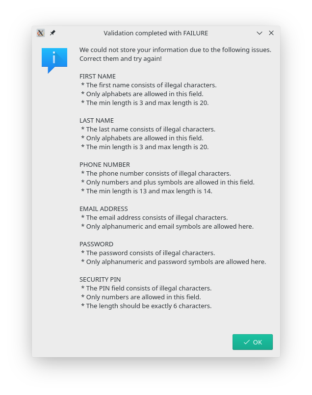
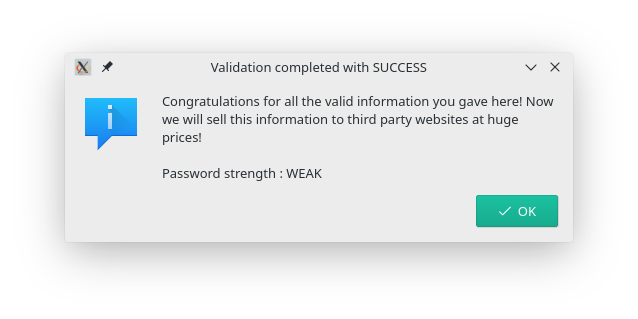

# regexpval-example
Version 0.05

A simple regular expression validator which looks, feels and works good

## Usage
1. Clone the project and make it your working directory
2. In terminal, type ```pip3 install -r requirements.txt``` and hit ENTER
3. Now type ```python3 index.py``` and hit ENTER to run the application
4. Give stars to the repository if it was helpful

## To-do
- [X] Validator function for first name (Length specified)
- [X] Validator function for last name (Length specified)
- [X] Validator function for phone number (Length specified)
- [X] Validator function for email address (Length NOT specified)
- [ ] Strength evaluator for password (Length NOT specified)
- [X] Validator function for security PIN (Length specified)
- [X] Add masking in the password field
- [X] Add masking in the security PIN field
- [X] Correct the tab order for fields

## Screenshots
* Window (all versions)

* Message for failed validation due to empty string (all versions)

* Message for failed validation due to illegal characters (till v0.04)

* Message for failed validation due to illegal characters (v0.05 onwards)

* Message for successful validation (till v0.04)

* Message for successful validation with password strength WEAK (v0.05 onwards)

* Message for successful validation with password strenght MEDIUM (v0.05 onwards)


## Changelog
### v0.01
1. Built the user interface 
2. Added validator functions for email and phone numbers
3. Added checking functions for empty strings

### v0.02
1. Added warning message boxes for failed validations
2. Added validator functions for first name, last name and security PIN
3. Made initial commit on Github

### v0.03
1. Replaced warning messages with information messages
2. Added warning messages for empty strings
3. Added length constraints for first name and last name

### v0.04
1. Provided masking for password and security PIN fields
2. Added length constraints for phone number and security PIN
3. Fixed tab shifting order of fields in GUI

### v0.05 (Current)
1. Added password strength evaluator function for WEAK and MEDIUM strengths
2. Added password strength message in successful input
3. Added clear buttons for all the fields

### v0.06 (Oncoming)
1. Fixed password strength evaluator function for HARD strength
2. Performed codebase cleanup for unnecessary dependencies
3. Optimise codebase for quick launch and speed

## Bugs
1. Password strength HARD __cannot__ be achieved as of 4th Nov 2019 (v0.05)

## Contribute
Clone, add, build and make a PR. You know the drill.
